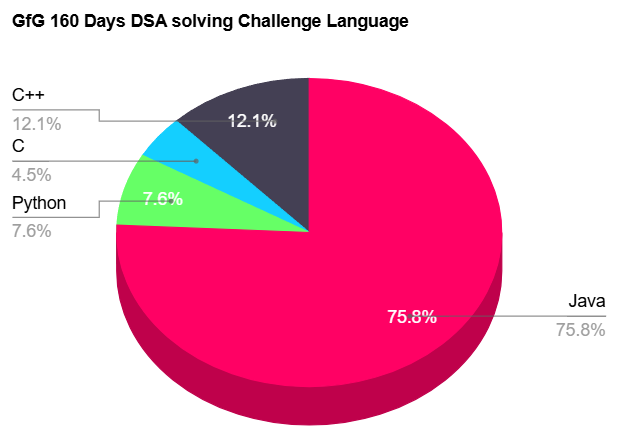
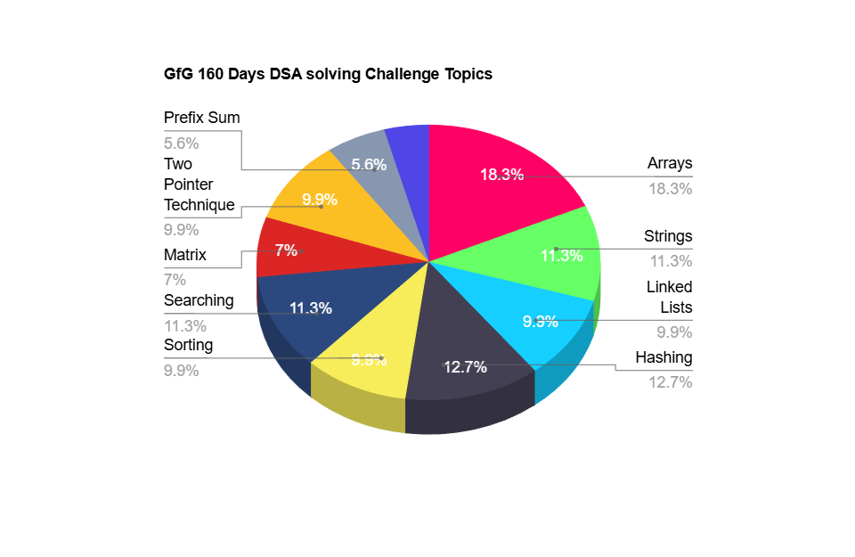

# 📝Daily GeeksforGeeks POTD Analysis

This repository tracks and analyzes my daily practice of GeeksforGeeks Problems of the Day (POTD). Below is a summary of the progress, categorized by difficulty levels, programming languages, and problem topics.

---

## 📊 Summary Statistics

### 🔍 Difficulty Levels
| Difficulty | Count | Percentage |
|------------|-------|------------|
| Easy       | 37    | 37.9%      |
| Medium     | 56    | 57.6%      |
| Hard       | 5     | 4.5%       |

---

### 💻 Languages Used
| Language   | Count | Percentage |
|------------|-------|------------|
| Java       | 75    | 75.8%      |
| C          | 4     | 4.5%       |
| Python     | 7     | 7.6%       |
| C++        | 12    | 12.1%      |

---

### 📚 Topics
| Topic                     | Count | Percentage |
|---------------------------|-------|------------|
| Arrays                    | 18    | 18.3%      |
| Strings                   | 11    | 11.3%      |
| Sorting                   | 10    | 9.9%       |
| Searching                 | 11    | 11.3%      |
| Matrix                    | 7     | 7.0%       |
| Hashing                   | 13    | 12.7%      |
| Two Pointer Technique     | 10    | 9.9%       |
| Linked Lists              | 10    | 9.9%       |
| Prefix Sum                | 6     | 5.6%       |

---

## 📈 Insights
- 🔥 I plan to solve more Hard problems to further strengthen my problem-solving abilities.
- 🌐 I aim to diversify my language usage to enhance my proficiency in **Java**, **Python**, **C**, and **C++**.
- 🧠 I will explore additional advanced topics to broaden my knowledge and skill set.

---

**Happy Coding!** 🚀
